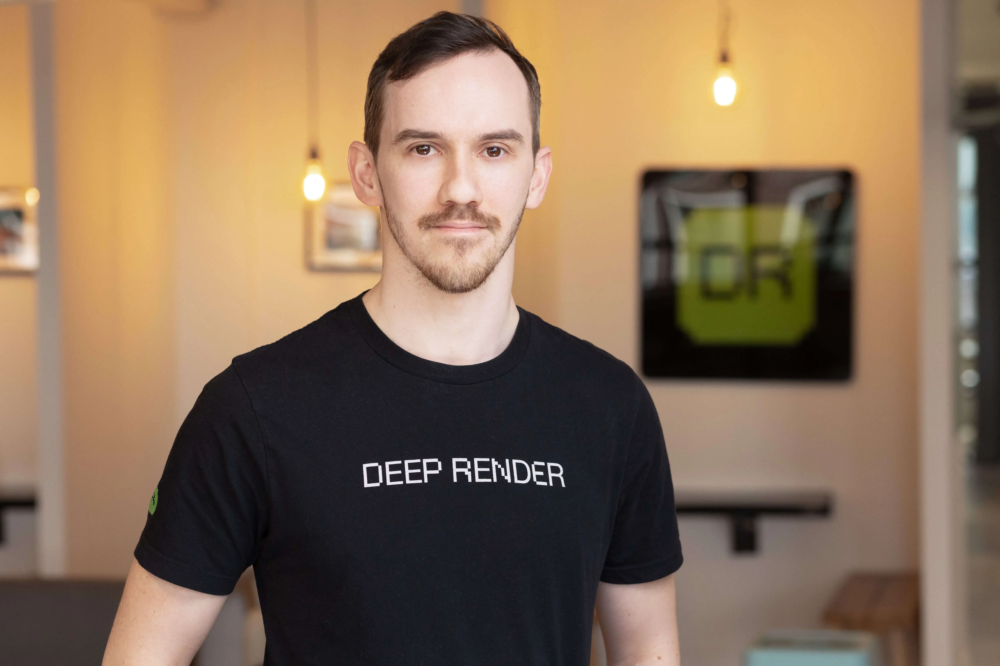

# Welcome to Sebastjan Cizel's Website

  

## About Me

I'm a research scientist with expertise in **machine learning**, **probability**, and **programming**, currently working in computer vision, researching neural network based image and video compression algorithms at Deep Render.

### Current Position

**Research Scientist** at Deep Render  
_September 2021 - Present_

Deep Render is a start-up focusing on developing perceptually optimized image and video compression algorithms based on AI. My day-to-day work consists of developing and testing new approaches and improvements to the video compression algorithm with the aim of optimizing both the compression and runtime performance on mobile platforms.

### Background

Before venturing into deep learning, I completed a DPhil in Mathematics at the University of Oxford, focusing on the intersection of geometry and string theory. This mathematical foundation provides me with a unique perspective on machine learning algorithms and their theoretical underpinnings.

## Quick Links

- :material-account-school:{ .lg .middle } **Education**

  ***

  Learn about my academic journey from Ljubljana to Oxford

  [:octicons-arrow-right-24: Education](about.md#education)

- :material-flask:{ .lg .middle } **Research**

  ***

  Explore my research in mathematics and machine learning

  [:octicons-arrow-right-24: Research](research.md)

- :material-rss:{ .lg .middle } **Blog**

  ***

  Read my thoughts on ML, mathematics, and technology

  [:octicons-arrow-right-24: Blog](blog/index.md)

## Get in Touch

I'm always interested in discussing machine learning, mathematics, and technology. Feel free to reach out!

  <a href="mailto:sebastjancizel@gmail.com" class="md-button md-button--primary">
    :fontawesome-solid-paper-plane: Contact Me
  </a>
  <a href="assets/Resume_CizelSebastjan.pdf" class="md-button">
    :fontawesome-solid-file-arrow-down: Download CV
  </a>

---
