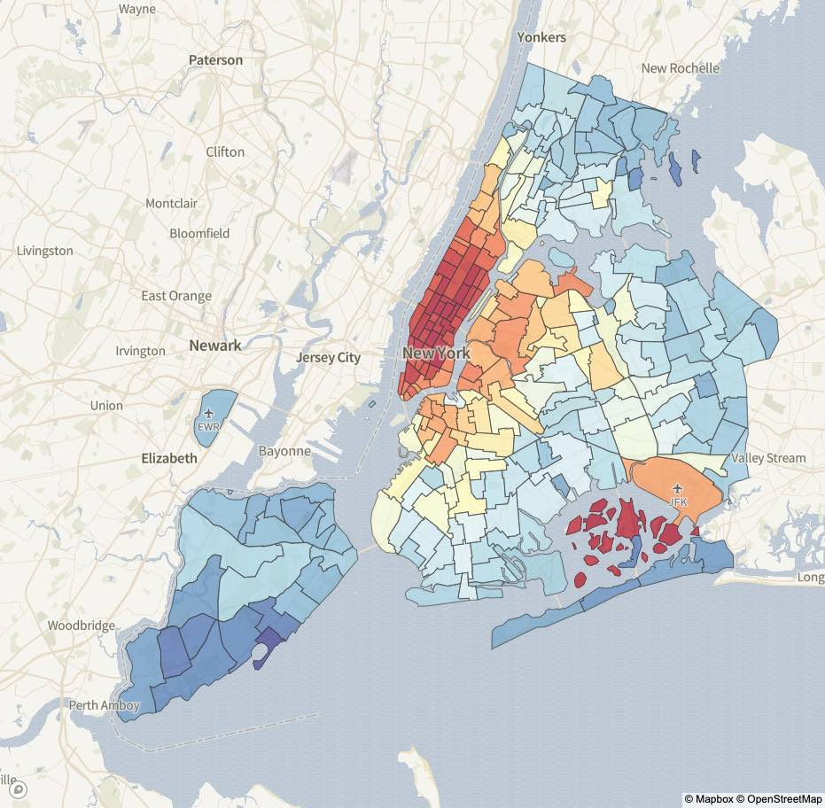

# Portfolio

## Featured Projects

### NYC Taxi Data Dashboard
**Category:** Data Visualization Dashboard  
**Description:** Dashboard I made visualizing 120 million taxi rides

  

An interactive dashboard that processes and visualizes over 120 million NYC taxi ride records. This project demonstrates skills in:

- **Big Data Processing** - Handling large-scale datasets efficiently
- **Interactive Visualization** - Creating responsive, user-friendly interfaces
- **Web Development** - Full-stack development for data applications
- **Performance Optimization** - Ensuring smooth performance with massive datasets

[:material-open-in-new: View Live Dashboard](https://nyc-taxi-dashboard.herokuapp.com/){ .md-button .md-button--primary }

## Technical Projects

### JLOX Interpreter
A complete interpreter implementation for the Lox programming language, written in Java. This project showcases:

- **Language Design** - Understanding of parsing, lexical analysis, and interpretation
- **Software Architecture** - Clean, maintainable code structure
- **Java Programming** - Advanced Java concepts and best practices

[:fontawesome-brands-github: View on GitHub](https://github.com/sebastjancizel/jlox){ .md-button }

## Research & Development

### Neural Network Compression Algorithms
*Deep Render (2021-Present)*

Development of state-of-the-art AI-based image and video compression systems:

- **Perceptual Optimization** - Algorithms optimized for human visual perception
- **Mobile Performance** - Real-time compression for mobile devices
- **Research Impact** - Contributing to advancing the field of neural compression

### COVID-19 Data Visualization
*Sledilnik Project (2020-2021)*

Contributed to Slovenia's primary COVID-19 tracking platform:

- **Data Processing** - F# backend for data parsing and cleaning
- **Visualization** - Interactive charts using Highcharts API
- **Open Source Impact** - Community-driven project serving public health needs

[:material-open-in-new: Visit Sledilnik](https://covid-19.sledilnik.org/en/team){ .md-button }

## Academic Publications

### Mathematical Physics Research
During my DPhil at Oxford, I published research at the intersection of mathematics and theoretical physics:

- **String Theory & Geometry** - Explored higher-dimensional geometric structures
- **Mathematical Rigor** - Applied advanced mathematical techniques to physical problems
- **Interdisciplinary Collaboration** - Worked with international research teams

See the [Research](research.md) section for detailed publication information.

## Skills Demonstrated

### Programming Languages
- **Python** - Advanced (8+ years experience)
- **C++** - Working knowledge (PyTorch extensions)
- **Java** - Working knowledge (JLOX interpreter)
- **F#** - Working knowledge (Sledilnik backend)

### Machine Learning & AI
- **Deep Learning Frameworks** - PyTorch, TensorFlow
- **Computer Vision** - Image/video processing and compression
- **Experiment Management** - Weights & Biases, MLflow
- **Research & Development** - Algorithm design and optimization

### Data Science & Visualization
- **Data Processing** - Large-scale data handling and analysis
- **Visualization Libraries** - Highcharts, D3.js, matplotlib
- **Statistical Analysis** - Advanced statistical methods and probability theory
- **Dashboard Development** - Interactive web-based dashboards

### Mathematical & Theoretical
- **Pure Mathematics** - Advanced degree-level knowledge
- **Probability Theory** - Theoretical and applied probability
- **Optimization** - Mathematical optimization and algorithm design
- **Research Methodology** - Academic research and publication experience

---

*For more details about any of these projects or to discuss potential collaborations, feel free to [get in touch](mailto:sebastjancizel@gmail.com).*
